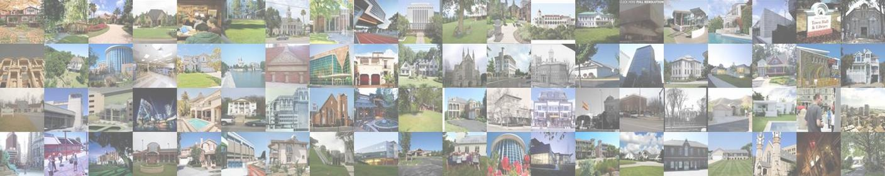

# MiniPlaces Challenge: Image Classification Benchmark for the Education of Deep Learning in Computer Vision


## Introduction

We introduce the image classification benchmark, MiniPlaces Challenge, as an educational tool for practioners of deep learning in computer vision. Through improving the baseline models and building new deep neural networks for image classification, participants in the challenge are expected to gain a deeper understanding of deep neural networks and gain hands-on experience tuning models.

The goal of this challenge is to identify the scene category depicted in a photograph. The data for this task comes from the [Places2 dataset](http://places2.csail.mit.edu/), which contains 10+ million images belonging to 400+ unique scene categories. The challenge data will be a subset of the full Places2 dataset, coming from 100 scene categories and consisting of 100,000 images for training, 10,000 images for validation, and 10,000 images for testing. The images will be resized to 128x128 to make the data more manageable. Furthermore, while the end goal is scene recognition, a subset of the data will contain object labels that might be helpful to build better models.

The MiniPlaces challenge was first initiated by [Bolei Zhou](http://people.csail.mit.edu/bzhou/) and [Aditya Khosla](http://people.csail.mit.edu/khosla/) in the Fall 2015 [6.819/6.869 Advances in Computer Vision course](http://6.869.csail.mit.edu/fa15/index.html) at MIT, and is further contributed by various following TAs for that course.

The following is the documentation of the MiniPlaces Challenge development kit.
```
Table of contents:
  1. Overview of challenge dataset
  2. Challenge details
    2.1 Images and annotations
    2.2 Submission format
    2.3 Evaluation routines
  3. Baselines
  4. Reference
```

## 1. Overview of challenge dataset

The link for downloading the image data is [here](http://miniplaces.csail.mit.edu/data/data.tar.gz).

There are three types of image data for this competition, all coming from the larger Places2 dataset: training data (TRAINING), validation data (VALIDATION), and test (TEST). There is no overlap in the three splits of data.  All three splits contain images belonging to 100 scene categories.

```
               Number of images
   Dataset     TRAIN        VALIDATION   TEST
  ------------------------------------------------
   MiniPlaces  100,000      10,000       10,000
```

Every image in the training, validation and test sets has a single image-level label specifying the presence of one object category.

Challenge database statistics is as follows:

```
  Training: 	100,000 images, with 1000 images per category
  Validation:	10,000 images, with 100 images per category
  Test:		10,000 images, with 100 images per category
```

The 3 sets of images (training, validation and test) are available as a single tar archive. All images are in JPEG format. For the challenge, images have been resized to 128x128 to make the data manageable for students.

## 2. Challenge details

The 100 scene categories used in the challenge dataset are part of the larger [Places2 dataset](http://places2.csail.mit.edu). Mappings from class names to ids are available in [data/categories.txt](data/categories.txt), where each line contains the scene category name followed by its id (an integer between 0 and 99).

### Training data

Each image belongs to a particular scene category. After untarring the above file, the directory structure should look similar to the following:

```   
	train/a/abbey/00000000.jpg
     	train/a/abbey/00000001.jpg
	...
	train/y/yard/00000999.jpg      
	train/y/yard/00001000.jpg
```

In general, each leaf folder contains one scene category. The complete list of training images and their ground truth scene category id labels is available in [data/train.txt](data/train.txt). All images are in JPEG format.

### Validation data

There are a total of 10,000 validation images. They are named as:


```      
	val/00000001.jpg
	val/00000002.jpg
	...
	val/00009999.jpg
	val/00010000.jpg
```

There are 100 validation images for each scene category.

The classification ground truth for the validation images is in [data/val.txt](data/val.txt), where each line contains one image filename and its corresponding scene category label (from 0 to 99).

### Test data

There are a total of 10,000 test images. The test files are named as:

```      
	test/00000001.jpg
	test/00000002.jpg
	...
	test/00009999.jpg
	test/00010000.jpg
```

There are 100 test images for each scene category. Their ground truth annotations will not be released.

### Object annotations

For a subset of the images (3502 train images, and 371 validation images), we provide annotations of the common objects contained within that image. You may use these annotations in any way you see fit to enhance the performance of your algorithm on the scene recognition task. You are not required to use them -- the goal here is to provide additional avenues for exploration. You will not be judged on the quality of your object recognition.

The specific object annotations available are the bounding boxes and polygons for 175 different object categories in the 3502 train and 371 validation images. The list of object categories is provided in [data/object_categories.txt](data/object_categories.txt)

The annotations are provided in the 'objects' folder in the compressed file containing the image data. The images that have these annotations will have corresponding xml files in the objects folder. For example, the image `images/train/a/abbey/00000001.jpg` will have its object annotations located at `objects/train/a/abbey/00000001.xml`. As mentioned above, only a subset of the images are annotated with objects, so not all image files will have object annotations.

To facilitate reading of object annotations, we provide the following MATLAB function in the development kit [util/VOCreadxml.m](util/VOCreadxml.m). This function will read the XML file and convert it to a MATLAB structure containing the following fields:

```
- filename: name of the file
- folder: scene class name
- class: scene category id
- objects: a structure containing the bounding box information and polygon points delineating the objects. Either of these annotations may be helpful depending on how you intend to use them
```

### Submission format

The submission of results on test data will consist of a text file with one line per image, in alphabetical order of the image file names, i.e. from test/00000001.jpg to test/00010000.jpg. Each line contains up to 5 detected scenes, sorted by confidence in descending order.

The format is as follows:
```
   <filename> <label(1)> <label(2)> <label(3)> <label(4)> <label(5)>
```
The predicted labels are the scene categories (integers between 0 and 99).  The number of labels per line must be exactly equal to 5, or it would lead to an error. The filename is the same as mentioned above, e.g., 'test/00000001.jpg' and so on.

An example submission file for the validation data is at [evaluation/demo.val.pred.txt](evaluation/demo.val.pred.txt)

### Evaluation routines

The Matlab routine for evaluating the submission is [evaluation/eval_cls.m](evaluation/eval_cls.m)

To see an example of using the routines, start Matlab
in the 'evaluation/' folder and type
       demo_eval_cls;

and you will see something similar to the following output:

```
MINI PLACES SCENE CLASSIFICATION CHALLENGE
pred_file: demo.val.pred.txt
ground_truth_file: ../data/val.txt
  guesses vs cls error
    1.0000    0.9895
    2.0000    0.9791
    3.0000    0.9696
    4.0000    0.9602
    5.0000    0.9525
```

In this demo, we take the top i (i = 1...5) predictions (and ignore the rest) from your result file and plot the error as a function of the number of guesses.

Only the error with 5 guesses will be used to determine the winner. The demo.val.pred.txt used here is a synthetic result.

## 3. Baseline models

* The baseline models trained in [MatConvNet](http://www.vlfeat.org/matconvnet/) are available in [model/matconvnet](model/matconvnet).
* Training code for baseline AlexNet models in TensorFlow is available in [model/tensorflow](model/tensorflow).
* PyTorch model (TODO).

## 4. Reference 
Link: [Places2 Database](http://places2.csail.mit.edu), [Places1 Database](http://places.csail.mit.edu)

Please cite the following [places journal paper](http://places2.csail.mit.edu/PAMI_places.pdf) if you use the data or pretrained CNN models.

```
 @article{zhou2017places,
   title={Places: A 10 million Image Database for Scene Recognition},
   author={Zhou, Bolei and Lapedriza, Agata and Khosla, Aditya and Oliva, Aude and Torralba, Antonio},
   journal={IEEE Transactions on Pattern Analysis and Machine Intelligence},
   year={2017},
   publisher={IEEE}
 }
```

Please contact Bolei Zhou (bzhou@csail.mit.edu) if you have questions or comments on the general design of the MiniPlaces challenge. If you an MIT student taking 6.819/6.869: Advances in Computer Vision, please contact the [teaching staff](http://6.869.csail.mit.edu/) for any course-related problems.
